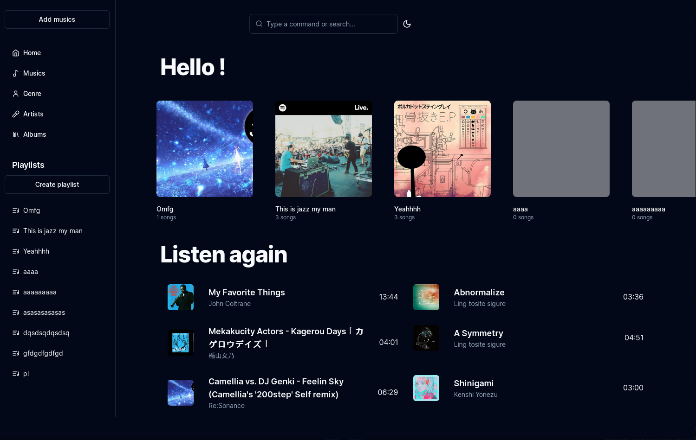

<p align="center">
    
</p>
<h1 align="center">Symfoniya</h1>
<p align="center"><strong>Simple elegant music player</strong></p>

## Note
This projet is still in developpement, be aware that some bug may happen.

## Gallery




## Features
- [x] Create playlists
- [x] Import multiple source folder
- [x] System queue (play next, play later, shuffle, repeat)
- [ ] Seeking support ([rodio doesn't support it](https://github.com/RustAudio/rodio/issues/176), may using [react-native-track-player](https://github.com/doublesymmetry/react-native-track-player) instead)
- [ ] Nav button for playlists in Home screen (may use [keen-slider](https://keen-slider.io/)
- [ ] Search bar with shortcuts
- [ ] Download music from YouTube and Spotify
- [ ] Import playlists from YouTube and Spotify

## Getting Started

### Running development server and use Tauri window

After cloning for the first time, set up git pre-commit hooks:

```shell
pnpm prepare
```

To develop and run the frontend in a Tauri window:

```shell
pnpm dev
```

This will load the Next.js frontend directly in a Tauri webview window, in addition to
starting a development server on `localhost:3000`.

### Build

```shell
pnpm build
```

### Source structure

Next.js frontend source files are located in `src/` and Tauri Rust application source
files are located in `src-tauri/`. Please consult the Next.js and Tauri documentation
respectively for questions pertaining to either technology.


